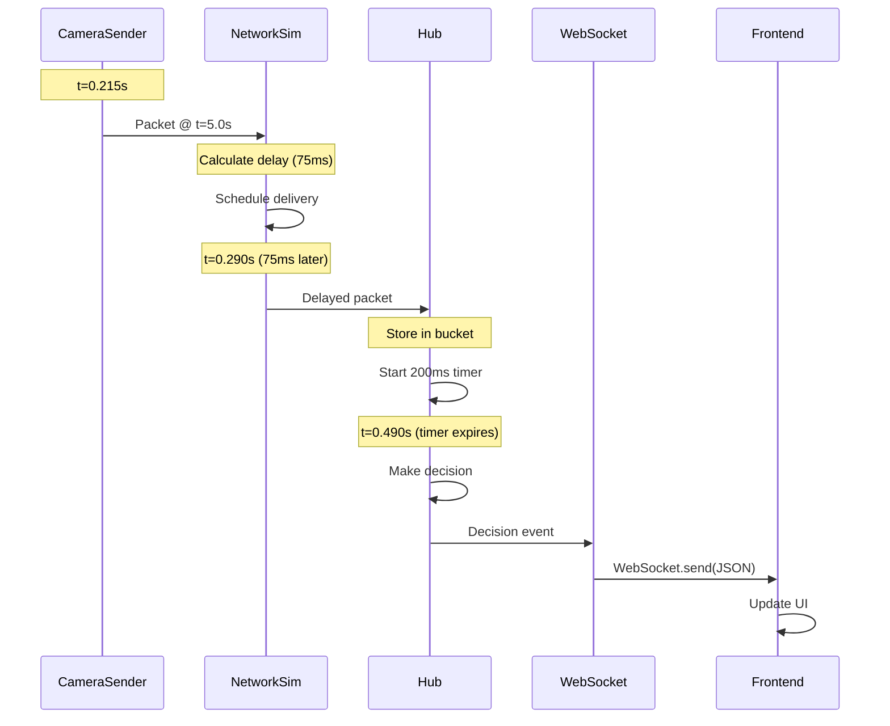

# NEW Emulator - Complete Deep Dive

**Directory**: `c:\Users\admin\Desktop\FYP-final\emulator\`

This is the **NEW simplified emulator** (NOT the old `DATA_EMULATOR`).

---

## Architecture Overview

### **Files** (886 total lines)

```
emulator/
├── config.py (47 lines)          # Configuration constants
├── json_reader.py (105 lines)    # Loads JSON track data
├── camera_sender.py (135 lines)  # Simulates one camera
├── network_sim.py (125 lines)    # Applies jitter & packet loss
├── hub.py (205 lines)            # Central aggregator
├── websocket_server.py (128 lines) # Broadcasts to frontend
└── app.py (141 lines)            # Main orchestrator
```

### **Data Flow**

```
JSON Files → CameraSenders (5) → NetworkSim → Hub → WebSocket → Frontend
              ↓                    ↓            ↓       ↓
         Packets (1 FPS)    Jitter+Loss   Decisions  JSON
```

---

## Component Breakdown

### **1. config.py** - Configuration

**Key Settings**:

```python
# Lines 5-7: Camera setup
CAMERAS = ['c001', 'c002', 'c003', 'c004', 'c005']
JSON_DIR = 'json'
JSON_PATTERN = 'S01_{camera}_tracks_data.json'

# Lines 19-24: Emulator timing
FPS = 1              # 1 frame per second
TIME_STEP = 1.0      # 1 second intervals
START_TIME = 5.0     # Start at t=5.0s
END_TIME = 60.0      # End at t=60.0s (55 seconds total)

# Lines 27-29: Network simulation
BASE_LATENCY_MS = 60    # Base delay
JITTER_MS = 120         # Jitter range (normal distribution)
PACKET_LOSS_PROB = 0.01 # 1% packet loss

# Lines 32-33: Hub settings
WATERMARK_MS = 200   # Wait up to 200ms for packets
QUORUM = 3           # Minimum 3 cameras for PARTIAL decision

# Lines 40-46: Sentence words for visualization
SENTENCE_WORDS = {
    'c001': 'The quick',
    'c002': 'brown fox',
    'c003': 'jumps over',
    'c004': 'the lazy',
    'c005': 'dog'
}
```

---

### **2. json_reader.py** - Data Loading

**Function**: `load_detections_from_json()` (Lines 14-74)

- Opens JSON file (e.g., `json/S01_c001_tracks_data.json`)
- Parses `{"tracks": [...]}` structure
- Organizes detections by timestamp

**Returns**:

```python
{
    5.0: [
        {'track_id': 3, 'bbox': [...], 'birdeye': [...], 'vehicle_class': 'Pickup', ...},
        ...
    ],
    6.0: [...],
    ...
}
```

**Function**: `load_all_cameras()` (Lines 77-104)

- Loads data for all 5 cameras
- Returns: `{camera_id: detections_by_timestamp}`

---

### **3. camera_sender.py** - Camera Simulator

**Class**: `CameraSender`

**Main Loop**: `run()` (Lines 103-134)

```python
while self._current_timestamp <= self.end_time:  # 5.0 to 60.0
    # Create packet for current timestamp
    packet = self._create_packet()
    await output_queue.put(packet)  # Send to NetworkSim

    # Increment timestamp
    self._current_timestamp += 1.0  # Next second

    # Sleep to maintain 1 FPS
    await asyncio.sleep(1.0)
```

**Packet Structure** (Lines 84-93):

```python
{
    'type': 'packet',
    'camera_id': 'c001',
    'timestamp': 5.0,
    'frame': 0,
    'ts_send_ms': 1735219200000,
    'sentence_word': 'The quick',
    'detections': [...]  # From JSON
}
```

---

### **4. network_sim.py** - Network Chaos

**Jitter Calculation**: `_calculate_delay()` (Lines 39-50)

```python
# Normal distribution: mean=0, std=jitter/3
noise = random.gauss(0, self.jitter_ms / 3)  # std = 40ms
delay_ms = max(0, self.base_latency_ms + noise)  # 60 + noise
```

**Main Loop**: `run()` (Lines 76-109)

```python
while True:
    packet = await input_queue.get()  # From CameraSender

    # Check packet loss (1%)
    if random.random() < 0.01:
        continue  # Drop packet

    # Calculate delay
    delay_ms = self._calculate_delay()  # e.g., 75ms

    # Schedule delivery (async task)
    asyncio.create_task(self._schedule_delivery(packet, delay_ms, output_queue))
```

**Delivery**: `_schedule_delivery()` (Lines 52-74)

```python
await asyncio.sleep(delay_ms / 1000.0)  # Wait for delay
packet['ts_recv_ms'] = int(time.time() * 1000)
packet['actual_delay_ms'] = delay_ms
await output_queue.put(packet)  # Send to Hub
```

---

### **5. hub.py** - Central Aggregator

**State Variables** (Lines 41-43):

```python
self._frame_buckets = {}      # {timestamp: {camera_id: packet}}
self._frame_timers = {}       # {timestamp: asyncio.Task}
self._frame_first_arrival = {} # {timestamp: first_arrival_ms}
```

**Packet Handling**: `_handle_packet()` (Lines 56-96)

```python
bucket_key = self._get_bucket_key(timestamp)  # Round to 1.0s

# Initialize bucket if new
if bucket_key not in self._frame_buckets:
    self._frame_buckets[bucket_key] = {}
    self._frame_first_arrival[bucket_key] = int(time.time() * 1000)

    # Start 200ms watermark timer
    self._frame_timers[bucket_key] = asyncio.create_task(
        self._start_watermark_timer(bucket_key)
    )

# Store packet
self._frame_buckets[bucket_key][camera_id] = packet

# Check for early completion (all 5 cameras)
if len(self._frame_buckets[bucket_key]) == 5:
    self._frame_timers[bucket_key].cancel()
    await self._make_decision(bucket_key, "complete")
```

**Watermark Expiry**: `_on_watermark_expiry()` (Lines 108-124)

```python
arrived_count = len(self._frame_buckets[bucket_key])

if arrived_count >= 5:
    decision = "complete"
elif arrived_count >= 3:  # Quorum
    decision = "partial"
else:
    decision = "drop"

await self._make_decision(bucket_key, decision)
```

**Decision Event** (Lines 156-164):

```python
{
    'type': 'decision',
    'timestamp': 5.0,
    'decision': 'partial',
    'arrived_cameras': ['c001', 'c002', 'c003', 'c004'],
    'missing_cameras': ['c005'],
    'latency_ms': 200,
    'sentence_status': {
        'c001': {'word': 'The quick', 'arrived': True, 'delay_ms': 75},
        'c002': {'word': 'brown fox', 'arrived': True, 'delay_ms': 40},
        'c003': {'word': 'jumps over', 'arrived': True, 'delay_ms': 90},
        'c004': {'word': 'the lazy', 'arrived': True, 'delay_ms': 55},
        'c005': {'word': 'dog', 'arrived': False, 'delay_ms': 0}
    }
}
```

---

### **6. websocket_server.py** - Frontend Broadcaster

**Broadcast Loop**: `broadcast_loop()` (Lines 94-113)

```python
while True:
    event = await decision_queue.get()  # Wait for decision from Hub
    await self.broadcast(event)         # Send to all WebSocket clients
```

**Broadcast**: `broadcast()` (Lines 42-64)

```python
message_json = json.dumps(message)  # Convert to JSON string

for client in self.clients:
    await client.send(message_json)  # Send via WebSocket
```

---

### **7. app.py** - Main Orchestrator

**Startup Sequence** (Lines 32-135):

1. **Load JSON data** (Lines 39-49)

```python
all_camera_data = load_all_cameras(
    config.JSON_DIR,
    config.CAMERAS,
    config.JSON_PATTERN
)
```

2. **Create queues** (Lines 51-54)

```python
sender_to_network_queue = asyncio.Queue()
network_to_hub_queue = asyncio.Queue()
hub_to_websocket_queue = asyncio.Queue()
```

3. **Create components** (Lines 56-94)

```python
# 5 CameraSenders
camera_senders = [CameraSender(...) for camera_id in config.CAMERAS]

# 1 NetworkSimulator
network_sim = NetworkSimulator(...)

# 1 Hub
hub = Hub(...)

# 1 WebSocketServer
ws_server = WebSocketServer(...)
```

4. **Create 8 async tasks** (Lines 96-116)

```python
tasks = []
for sender in camera_senders:
    tasks.append(asyncio.create_task(sender.run(sender_to_network_queue)))
tasks.append(asyncio.create_task(network_sim.run(...)))
tasks.append(asyncio.create_task(hub.run(...)))
tasks.append(asyncio.create_task(ws_server.run(...)))
```

5. **Run all tasks** (Lines 125-135)

```python
await asyncio.gather(*tasks)  # Run until Ctrl+C or completion
```

---

## Execution Timeline

### **Startup (t=0.0s)**

```
t=0.000s: Python starts, asyncio.run(main())
t=0.010s: Load JSON data for 5 cameras
t=0.200s: Create queues, components, tasks
t=0.214s: All 8 tasks start running
```

### **First Frame (t=5.0s)**

```
t=0.215s: All 5 CameraSenders create packets @ t=5.0s
t=0.215s: All 5 packets sent to sender_to_network_queue

t=0.216s: NetworkSim receives packets
t=0.216s: c001 → delay=75ms, c002 → delay=40ms, c003 → delay=90ms
t=0.216s: c004 → delay=55ms, c005 → DROPPED (packet loss)

t=0.256s: c002 arrives at Hub (40ms delay)
          → Create bucket for t=5.0, start 200ms timer
t=0.271s: c004 arrives at Hub (55ms delay)
t=0.291s: c001 arrives at Hub (75ms delay)
t=0.306s: c003 arrives at Hub (90ms delay)

t=0.456s: Watermark timer expires (200ms)
          → Decision: PARTIAL (4/5 cameras, quorum met)
          → Send decision event to WebSocket

t=0.457s: WebSocket broadcasts decision to frontend
t=0.458s: Frontend updates UI (4 words green, 1 red)
```

### **Second Frame (t=6.0s)**

```
t=1.215s: All CameraSenders increment timestamp to 6.0
t=1.215s: Sleep 1.0s to maintain 1 FPS
t=2.215s: Create packets @ t=6.0s
...
```

---

## Data Flow Diagram



---

## Key Insights

### **Why 1 FPS?**

- Slow enough to visually observe packet arrivals
- Each decision takes ~1 second (easy to follow)

### **Why Normal Distribution for Jitter?**

- Realistic network behavior
- 99.7% of delays within ±120ms
- Creates natural variation

### **Why Watermark Timer?**

- Can't wait forever for missing cameras
- 200ms is reasonable timeout
- Allows quorum-based decisions

### **Why Quorum = 3?**

- Majority of 5 cameras
- Tolerates 2 camera failures
- Balances completeness vs. availability

---

## Summary

**The NEW emulator**:

1. Loads JSON track data (5 cameras)
2. Emits packets at 1 FPS
3. Applies network jitter (normal distribution) and packet loss
4. Aggregates packets with watermark timing (200ms)
5. Makes decisions based on quorum (≥3 cameras)
6. Broadcasts to frontend via WebSocket

**Total**: 886 lines of clean, async Python code
